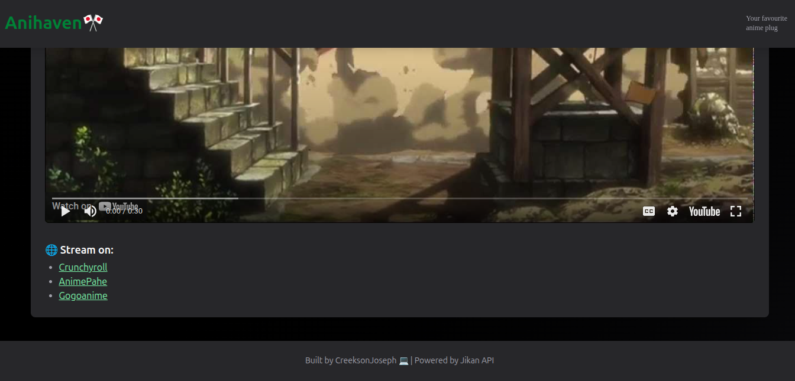

# 🎌 AniHaven

> Your ultimate anime discovery tool - Search, discover, and stream your favorite anime with ease!

[](https://creeksonjoseph.github.io/AniHaven/)
[](LICENSE)
[]()
[]()
[]()

## ✨ Features

- 🔍 **Real-time Search** - Live search with debounced input for smooth performance
- 📱 **Responsive Design** - Optimized for mobile, tablet, and desktop
- 🎬 **Embedded Trailers** - Watch anime trailers directly in the app
- ⭐ **Ratings & Reviews** - View anime scores and detailed synopses
- 🌐 **Streaming Links** - Direct links to popular streaming platforms
- ♾️ **Infinite Scroll** - Seamless browsing with pagination
- 🔥 **Trending Anime** - Discover what's popular right now
- 🚀 **SEO Optimized** - Enhanced meta tags and structured data
- ⚡ **Fast Loading** - Optimized images and lazy loading

## 📸 Screenshots

### Home Page


### Anime Details


### Trailer View


### Streaming Links



## 🚀 Quick Start

### Prerequisites

- Node.js (for Tailwind CSS compilation)
- Modern web browser

### Installation

1. **Clone the repository**

   ```bash
   git clone https://github.com/creeksonjoseph/AniHaven.git
   cd AniHaven
   ```

2. **Install dependencies**

   ```bash
   npm install
   ```

3. **Build Tailwind CSS** (if making style changes)

   ```bash
   npx tailwindcss -i ./src/input.css -o ./src/output.css --watch
   ```

4. **Open in browser**
   ```bash
   # Simply open index.html in your browser
   # Or use a local server:
   python -m http.server 8000
   # Then visit http://localhost:8000
   ```

## 🛠️ Tech Stack

| Technology             | Purpose                         | Version |
| ---------------------- | ------------------------------- | ------- |
| **HTML5**              | Structure & Semantics           | Latest  |
| **Tailwind CSS**       | Styling & Responsive Design     | ^4.1.10 |
| **Vanilla JavaScript** | Interactivity & API Integration | ES6+    |
| **Jikan API**          | Anime Data Source               | v4      |

## 🔧 Key Features Implementation

### Real-time Search

- Debounced input (400ms delay) for optimal API usage
- Live results as you type
- Fallback to trending anime when search is cleared

### Infinite Scroll

- Automatic content loading on scroll
- Pagination handling for both search and trending
- Loading states and error handling

### Responsive Design

- Mobile-first approach
- Adaptive layouts for different screen sizes
- Touch-friendly interface

### SEO Optimization

- Comprehensive meta tags
- Open Graph and Twitter Card support
- Structured data (JSON-LD)
- Dynamic meta updates for anime pages

## 🌐 API Integration

AniHaven uses the [Jikan API](https://jikan.moe/) - an unofficial MyAnimeList API:

- **Trending Anime**: `GET /v4/top/anime`
- **Search**: `GET /v4/anime?q={query}`
- **Pagination**: Supports limit and page parameters
- **Rate Limiting**: Handled with proper error management

## 🎯 Usage

1. **Browse Trending** - View popular anime on the homepage
2. **Search Anime** - Type any anime name in the search bar
3. **View Details** - Click on any anime card for detailed information
4. **Watch Trailers** - Embedded YouTube trailers (when available)
5. **Find Streaming** - Direct links to popular anime platforms

## 🚀 Deployment

The app is deployed on GitHub Pages.

**Live URL**: [https://creeksonjoseph.github.io/AniHaven/](https://creeksonjoseph.github.io/AniHaven/)

### Deploy Your Own

1. Fork this repository
2. Enable GitHub Pages in repository settings
3. Select source as "Deploy from a branch" → `main` → `/ (root)`
4. Your site will be available at `https://yourusername.github.io/AniHaven/`

## 🤝 Contributing

Contributions are welcome! Here's how you can help:

1. **Fork** the repository
2. **Create** a feature branch (`git checkout -b feature/amazing-feature`)
3. **Commit** your changes (`git commit -m 'Add amazing feature'`)
4. **Push** to the branch (`git push origin feature/amazing-feature`)
5. **Open** a Pull Request

### Development Guidelines

- Follow existing code style
- Test on multiple devices/browsers
- Update documentation as needed
- Ensure SEO best practices

## 📝 License

This project is licensed under the MIT License - see the [LICENSE](LICENSE) file for details.

## 👨💻 Developer

**Charana Joseph**

- 📧 Email: [charanajoseph@gmail.com](mailto:charanajoseph@gmail.com)
- 🌐 GitHub: [@creeksonjoseph](https://github.com/creeksonjoseph)

## 🙏 Acknowledgments

- [Jikan API](https://jikan.moe/) for providing free anime data

---

<div align="center">
  <p>Made with ❤️ for anime lovers worldwide</p>
  <p>⭐ Star this repo if you found it helpful!</p>
</div>
